# Sienna Locomotive 2

[](https://travis-ci.com/trailofbits/sienna-locomotive)

Sienna Locomotive is a integrated fuzzing and crash triage platform with usability features
that are intended to attract a wider user base than conventional fuzzing tools.

Sienna Locomotive's primary goal is to bring all the power that software fuzzing has to offer into
the hands of less-experienced users. Of course, focusing on ease of use won't stop us from trying
to make it smarter and faster than the competition.

## Getting Started

Read this [blog post](https://blog.trailofbits.com/user-friendly-fuzzing-with-sienna-locomotive).

Watch this [demo video](https://drive.google.com/file/d/1KKh0dif3jwfr4bzpvkTv5alBJV1QOlJU/view?usp=sharing).

Check out the [user manual](./_assets/manual.pdf).

### High level architecture



### Installation

**IMPORTANT**: Sienna Locomotive 2 makes changes to the system it runs on in order to
facilitate its instrumentation. It will run best when installed on its own machine (including
virtual machines).

Pre-built binaries are available on the
[releases page](https://github.com/trailofbits/sienna-locomotive/releases).

To build Sienna Locomotive for yourself, continue reading.

### Building
First, clone the repository:
`git clone https://github.com/trailofbits/sienna-locomotive.git` (or download a zip)

#### Dependencies

Building SL2 requires the following:

* Windows 10, release 1803
    * Earlier versions of Windows 10 will probably work, 1809 support is pending.
* [CMake](https://cmake.org/download/)
* Visual Studio 2017 (Install components for Windows Console dev)
* DynamoRIO (Automatically installed with `make.ps1`)
* Python (3.7+)

#### Build Commands

Compilation, deployment, and cleanup is done via `make.ps1` in Sienna Locomotive's
root directory.

To install DynamoRIO and build the project:

`PS C:\proj\sl2\sienna-locomotive> .\make.ps1`

If any part of the build complains about missing tools or libraries, try running under
the Visual Studio Developer Command Prompt.

To clean the project of build artifacts, run `.\make.ps1 clean`.

Try `make.ps1 help` for more options and information.

#### Internal API Documentation

SL2's internals are documented using Doxygen.

If you want to build the doxygen documents.
  1. Install doxygen from http://ftp.stack.nl/pub/users/dimitri/doxygen-1.8.14-setup.exe
  1. `./make.ps1 doc`
  1. Open `doc/html/index.html` in your browser

### Running

#### Via the GUI

Running `sl2` will start the Qt frontend for the fuzzer.

This frontend is the default user interface, and should suffice for most use cases.

#### Via the CLI

For more advanced users, `sl2-cli` can be used to configure and run each SL2 component individually.

`sl2-cli -h` will print out a listing of all available options.

#### To run individual components manually

**NOTE**: Normal users can ignore this information.

From the root of the project:

```
# General Pattern:
.\dynamorio\bin64\drrun.exe -c build\client_name\Debug\client.dll [client_args] -- C:\path\to\target_application [target_args]

# triage
.\dynamorio\bin64\drrun.exe -c build\tracer\Debug\tracer.dll -- corpus\win_asm\crashes.exe 7

# wizard
.\dynamorio\bin64\drrun.exe -c build\wizard\Debug\wizard.dll -- build\corpus\test_application\Debug\test_application.exe 0

# server
build\server\Debug\server.exe

# fuzzer
.\dynamorio\bin64\drrun.exe -c build\fuzzer\Debug\fuzzer.dll -- build\corpus\test_application\Debug\test_application.exe 0 -f

# triage crash
.\dynamorio\bin64\drrun.exe -c sienna-locomotive\build\tracer\Debug\tracer.dll -r [RUN_ID] -- build\corpus\test_application\Debug\test_application.exe 0 -f

# targeting
.\dynamorio\bin64\drrun.exe -c build\fuzzer\Debug\fuzzer.dll -t 0,ReadFile -- build\corpus\test_application\Debug\test_application.exe 0 -f

.\dynamorio\bin64\drrun.exe -c build\tracer\Debug\tracer.dll -r [RUN_ID] -t 0,ReadFile -- build\corpus\test_application\Debug\test_application.exe 0 -f
```

#### Regression Test

`sl2-test` runs the SL2 regression tests.

You can also run the tests directly via `python sl2/test/__main__.py`.

## Triage

The triage system is a separate executable, `triager.exe` that is run by the harness.  It takes care of ranking exploitability, uniqueness, and binning of crashes.

### Winchecksec

Read the [winchecksec README](https://github.com/trailofbits/winchecksec).

### Exploitability

The Exploitability ranking is a score for the potential ability to exploit a crash based on 3 engines.  The ranks, ranging from High (4) to None (0), in order of likelyhood are:

  * **High** (4): The mostly likely case of a crash being exploitable.
  * **Medium** (3): Between High and Low.
  * **Low** (2): At or above the cutoff for low exploitability.
  * **Unknown** (1): Unknown cases are below the cutoff for low, but still have the potential to be of interest.
  * **None** (0): Very unlikely the crash is exploitable.

#### Engines

  * **Google's Breakpad**: This engine uses Google's Breakpad library, which parses minidump files and return an exploitability between High and None as well.
  * **Microsoft's `!exploitable`**: A reimplementation and approxmiation of the `!exploitable` command for `windbg`, built on top of breakpad.
  * **SL2 Tracer**: Uses the score from our own SL2 tracer, which takes taint information into consideration.

### triage.json

After the tracer has been run, `triager.exe` is run on the minidump file. It also loads any information generated by the tracer, and outputs the following json:

```c
{
    // This is the called functions before the crash
    "callStack": [
        140699242310037,
        140718144357416,
        140718144581792,
        140718144447545
    ],

    // The offending memory address
    "crashAddress": 140699242310037,

    // The reason of exception type
    "crashReason": "EXCEPTION_BREAKPOINT",

    // Exploitability from High to None
    "exploitability": "Unknown",

    // The instruction pointer at the time of the crash
    "instructionPointer": 14757395258967641292,

    // Path to the minidump analyzed
    "minidumpPath": "C:\\Users\\IEUser\\AppData\\Roaming\\Trail of Bits\\sl2\\runs\\78f20c60-eb12-410a-8378-342c3afec986\\initial.dmp",

    // Rank, or numeric version of exploitability from 0-4
    "rank": 1,

    // The ranks generated by each of the 3 engines
    "ranks": [
        0,
        0,
        1
    ],

    // A unique identifier for the crash. The algorithm uses 12 bits from the called functions,
    // and is unaffected by ASLR, function call order, or function call count
    "crashash": "f96808cfc4798256",

    // Stack pointer at time of crash
    "stackPointer": 14757395258967641292,

    // Unique tag for the crash for binning purposes
    "tag": "Unknown/EXCEPTION_BREAKPOINT/f96808cfc4798256",

    // Complete output from the tracer run
    "tracer": {
        "exception": "EXCEPTION_BREAKPOINT",
        "instruction": "int3",
        "last_calls": [
            140699242861232,
            140699242861064,
            140699242861064,
            140699242861056,
            140699242861184
        ],
        "last_insns": [
            140699242309722,
            140699242309725,
            140699242309727,
            140699242309730,
            140699242310037
        ],
        "location": 140699242310037,
        "reason": "breakpoint",
        "regs": [
            {
                "reg": "rax",
                "tainted": false,
                "value": 1080890113
            },
            //...............................................
        ],
        "score": 25,
        "tainted_addrs": [
            {
                "size": 8,
                "start": 2645403054665
            }
        ]
    }
}
```

## Developer Information

If you change anything that would break backwards compatibility, increment
`harness.config.VERSION`.  Examples of breaking changes include changes to the database structure,
changes to various binary formats, directory structures, and so forth.

## License

Sienna Locomotive is licensed and distributed under the AGPLv3 license. [Contact us](mailto:opensource@trailofbits.com) if you're looking for an exception to the terms.
